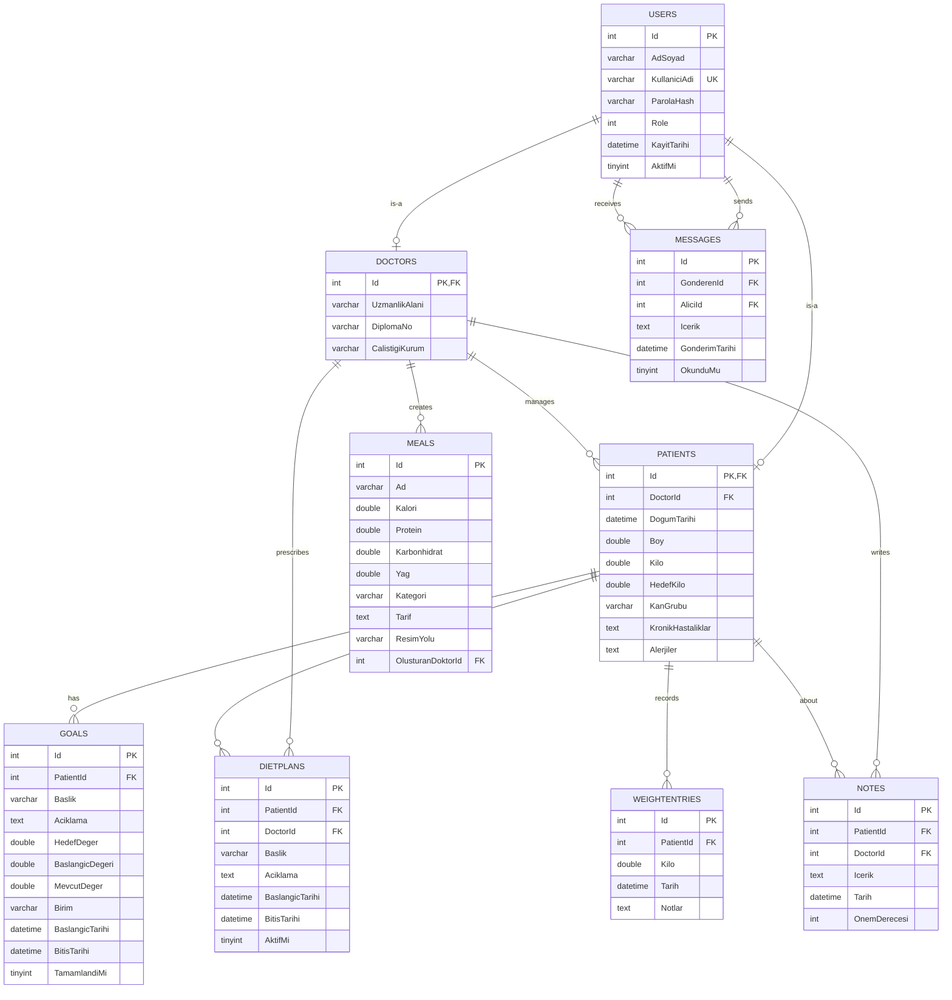

# ER Diyagramları - Diyetisyen Otomasyon Sistemi

## Veritabanı Genel Bilgisi

| Özellik | Değer |
|---------|-------|
| **VTYS** | MySQL |
| **Veritabanı Adı** | dietpro_db |
| **Karakter Seti** | utf8mb4 |
| **Collation** | utf8mb4_turkish_ci |
| **Tablo Sayısı** | 9 |

---

## Entity-Relationship Diyagramı

---

## Tablo Detayları

### USERS (Kullanıcılar)
Ana kullanıcı tablosu, Doctor ve Patient tablolarıyla TPT (Table Per Type) inheritance.

| Kolon | Tip | Kısıtlama | Açıklama |
|-------|-----|-----------|----------|
| Id | INT | PK, AUTO_INCREMENT | Benzersiz ID |
| AdSoyad | VARCHAR(255) | NOT NULL | Ad Soyad |
| KullaniciAdi | VARCHAR(100) | NOT NULL, UNIQUE | Giriş kullanıcı adı |
| ParolaHash | VARCHAR(255) | NOT NULL | SHA256 hash |
| Role | INT | NOT NULL | 0=Doctor, 1=Patient |
| KayitTarihi | DATETIME | NOT NULL | Kayıt tarihi |
| AktifMi | TINYINT | DEFAULT 1 | Aktif durumu |

### PATIENTS (Hastalar)
| Kolon | Tip | Kısıtlama | Açıklama |
|-------|-----|-----------|----------|
| Id | INT | PK, FK→Users | Kullanıcı ID |
| DoctorId | INT | FK→Users | Atanan doktor |
| DogumTarihi | DATETIME | - | Doğum tarihi |
| Boy | DOUBLE | - | Boy (cm) |
| Kilo | DOUBLE | - | Güncel kilo (kg) |
| HedefKilo | DOUBLE | - | Hedef kilo (kg) |
| KanGrubu | VARCHAR(10) | - | Kan grubu |
| KronikHastaliklar | TEXT | - | Kronik hastalıklar |
| Alerjiler | TEXT | - | Alerji bilgisi |

### MEALS (Yemekler)
| Kolon | Tip | Kısıtlama | Açıklama |
|-------|-----|-----------|----------|
| Id | INT | PK, AUTO_INCREMENT | Benzersiz ID |
| Ad | VARCHAR(255) | NOT NULL | Yemek adı |
| Kalori | DOUBLE | NOT NULL | Kalori (kcal) |
| Protein | DOUBLE | - | Protein (g) |
| Karbonhidrat | DOUBLE | - | Karbonhidrat (g) |
| Yag | DOUBLE | - | Yağ (g) |
| Kategori | VARCHAR(50) | - | Kahvaltı/Öğle/Akşam |
| Tarif | TEXT | - | Hazırlanış tarifi |
| OlusturanDoktorId | INT | FK→Users | Oluşturan doktor |

---

## İlişki Açıklamaları

| İlişki | Tip | Açıklama |
|--------|-----|----------|
| Users → Patients | 1:0..1 | Inheritance (TPT) |
| Users → Doctors | 1:0..1 | Inheritance (TPT) |
| Doctors → Patients | 1:N | Doktor-Hasta atama |
| Patients → WeightEntries | 1:N | Kilo takibi kayıtları |
| Patients → Goals | 1:N | Hasta hedefleri |
| Doctors → Meals | 1:N | Oluşturulan yemekler |
| Users → Messages | N:N | Mesajlaşma (self-ref) |

---

## Normalizasyon Durumu

| Normal Form | Durum | Açıklama |
|-------------|-------|----------|
| **1NF** | ✅ | Atomic değerler, tekrar eden gruplar yok |
| **2NF** | ✅ | Kısmi bağımlılık yok |
| **3NF** | ✅ | Geçişken bağımlılık yok |
| **BCNF** | ✅ | Her determinant aday anahtar |
