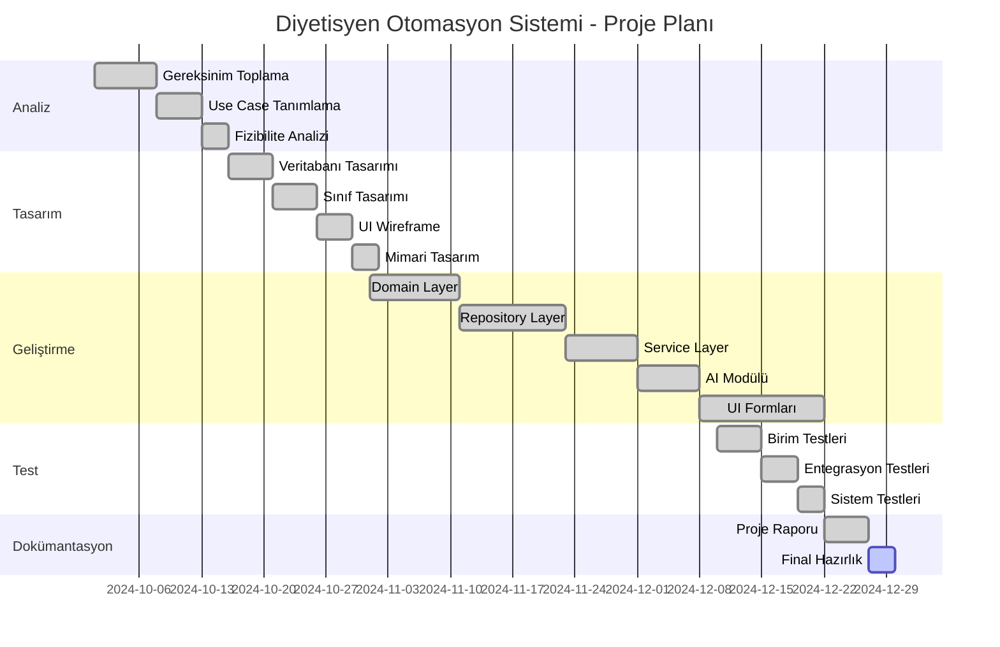
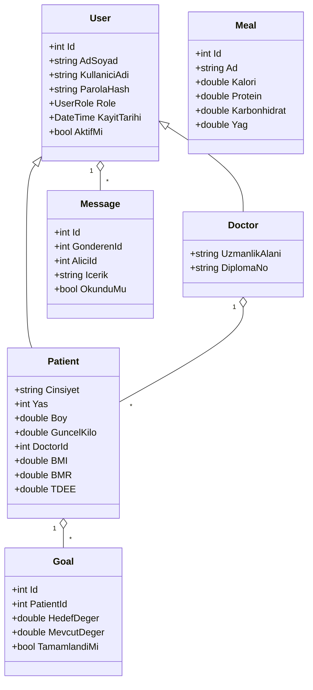
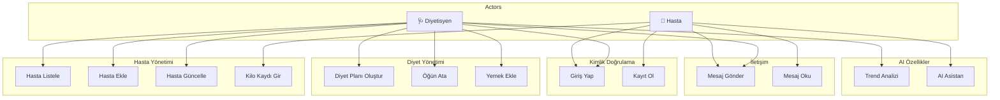
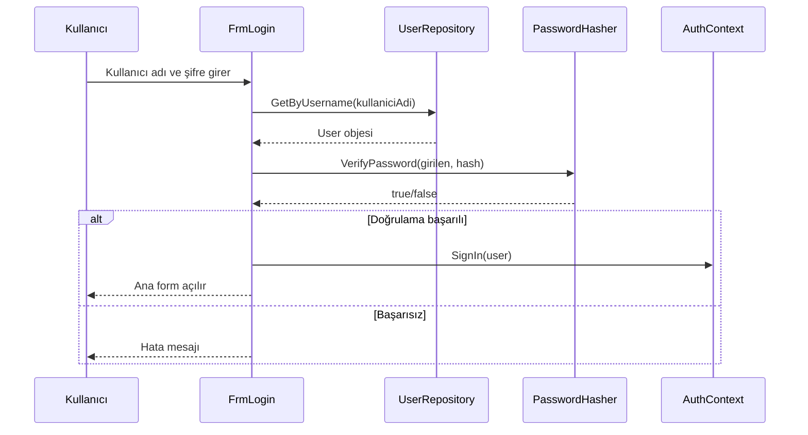
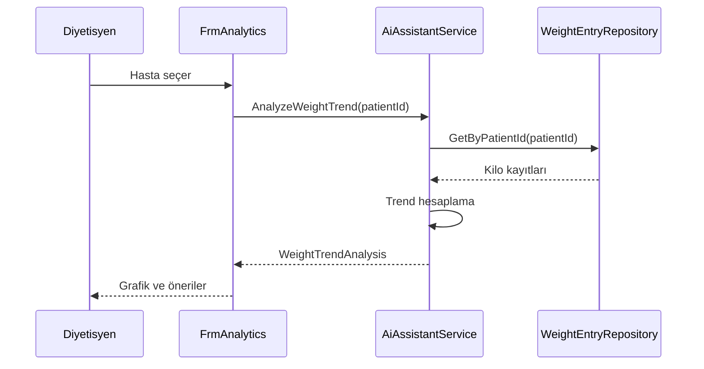
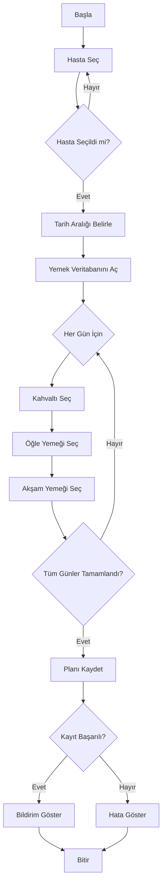
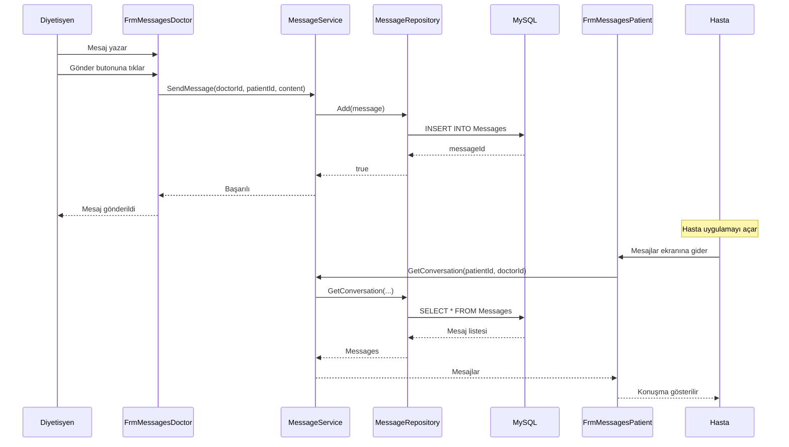
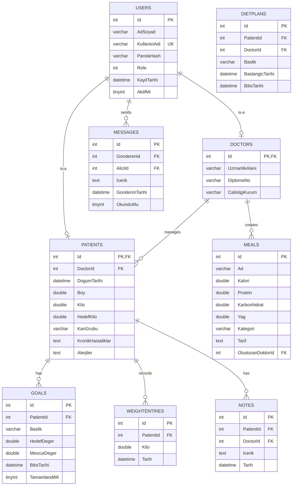

# DİYETİSYEN OTOMASYON SİSTEMİ
## Final Proje Raporu

---

**Proje Adı:** Diyetisyen Otomasyon Sistemi  
**Öğrenci Adı:** [AD SOYAD]  
**Öğrenci No:** [ÖĞRENCİ NO]  
**Ders:** Yazılım Mühendisliği  
**Dönem:** 2024-2025 Güz  
**Teslim Tarihi:** Aralık 2024

---

# 1. GİRİŞ

## 1.1 Projenin Tanıtılması

**Diyetisyen Otomasyon Sistemi**, diyetisyenler ve hastaları arasındaki iletişimi, diyet planlamasını ve ilerleme takibini dijitalleştiren kapsamlı bir masaüstü uygulamasıdır.

Bu sistem:
- Diyetisyenlerin hastalarını merkezi bir panelden yönetmesini sağlar
- **Yapay zeka destekli** analiz ve öneri sistemi içerir
- Kilo takibi ve trend analizi yapar
- Profesyonel mesajlaşma altyapısı sunar
- Görsel analitik raporlar üretir

**Projenin Özellikleri:**
- Modern ve profesyonel kullanıcı arayüzü (DevExpress)
- Katmanlı mimari (Layered Architecture)
- Nesneye yönelik tasarım prensipleri (OOP)
- Repository Pattern ile veri erişim soyutlaması
- MySQL veritabanı entegrasyonu

## 1.2 Projenin Amacı

Bu projenin temel amaçları:

1. **Hasta Yönetimi**: Diyetisyenlerin hastalarını ekleyebileceği, düzenleyebileceği ve takip edebileceği bir sistem oluşturmak

2. **Diyet Planlama**: Kişiselleştirilmiş haftalık diyet planları oluşturma ve hastaya atama

3. **Yapay Zeka Entegrasyonu**: 
   - Kilo trend analizi
   - Diyet uyum değerlendirmesi
   - Risk tespiti ve uyarı sistemi
   - Motivasyon mesajları üretme
   - Soru-cevap asistanı

4. **İletişim**: Diyetisyen-hasta arasında güvenli mesajlaşma platformu

5. **Raporlama**: Görsel grafikler ve analitik dashboardlar ile ilerleme takibi

## 1.3 Projenin Kapsamı

### Kapsam İçi

| Modül | Açıklama |
|-------|----------|
| Kimlik Doğrulama | Giriş, kayıt, rol tabanlı erişim |
| Hasta Yönetimi | CRUD işlemleri, profil yönetimi |
| Kilo Takibi | Kilo kayıtları, trend grafikleri |
| Diyet Planlama | Yemek veritabanı, haftalık plan atama |
| Hedef Yönetimi | Hedef belirleme, ilerleme takibi |
| Mesajlaşma | İki yönlü mesajlaşma, kategori/öncelik |
| AI Asistan | Analiz, öneri, motivasyon |
| Analitik | Grafikler, raporlar |

### Kapsam Dışı

- Mobil uygulama
- Online ödeme sistemi
- Randevu takvimi
- Video görüşme
- E-posta entegrasyonu
- Çoklu dil desteği

## 1.4 Kullanılacak Teknolojiler

| Kategori | Teknoloji | Versiyon |
|----------|-----------|----------|
| **Programlama Dili** | C# | 7.3 |
| **Framework** | .NET Framework | 4.8 |
| **UI Framework** | Windows Forms | - |
| **UI Bileşenleri** | DevExpress | 25.1 |
| **Veritabanı** | MySQL | 8.0 |
| **Veri Erişim** | ADO.NET | - |
| **IDE** | Visual Studio | 2022 |
| **Veritabanı Yönetimi** | MySQL Workbench / phpMyAdmin | - |
| **Versiyon Kontrol** | Git | - |

**Kullanılan Araçlar:**
- Visual Studio 2022 - Geliştirme ortamı
- XAMPP - Yerel MySQL sunucu
- NuGet - Paket yönetimi
- Mermaid - UML diyagram çizimi

---

# 2. PROJE PLANI

## 2.1 Sistemin Kullanıcıları

| Kullanıcı | Rol | Yetkiler |
|-----------|-----|----------|
| **Diyetisyen (Doktor)** | Yönetici | Hasta ekleme/düzenleme, diyet planı oluşturma, yemek veritabanı yönetimi, hedef belirleme, not ekleme, mesaj gönderme, analitik görüntüleme |
| **Hasta** | Son Kullanıcı | Profil görüntüleme, kilo girişi, ilerleme takibi, haftalık menü görüntüleme, mesaj gönderme, AI asistan kullanma |

## 2.2 GANTT İş Akış Diyagramı



## 2.3 İşlevsel İhtiyaçlar (Olmazsa Olmazlar)

| No | İhtiyaç | Açıklama |
|----|---------|----------|
| F1 | Kullanıcı Girişi | Güvenli giriş ve rol tabanlı yönlendirme |
| F2 | Hasta Yönetimi | Hasta ekleme, düzenleme, silme, listeleme |
| F3 | Kilo Takibi | Kilo kaydı girme ve geçmiş görüntüleme |
| F4 | Diyet Planı | Haftalık plan oluşturma ve atama |
| F5 | Yemek Veritabanı | Yemek ekleme, kalori/makro bilgisi |
| F6 | Mesajlaşma | Diyetisyen-hasta iletişimi |
| F7 | Hedef Belirleme | Hedef tanımlama ve ilerleme takibi |
| F8 | Analitik | Kilo grafiği, makro dağılımı |

## 2.4 İşlevsel Olmayan İhtiyaçlar (İlave Özellikler)

| No | İhtiyaç | Açıklama |
|----|---------|----------|
| NF1 | **Güvenlik** | SHA256 + Salt parola hashleme, rol tabanlı erişim |
| NF2 | **Kullanılabilirlik** | Sezgisel arayüz, Türkçe dil desteği |
| NF3 | **Performans** | < 2 saniye sayfa yükleme |
| NF4 | **Bakılabilirlik** | Modüler yapı, kod dokümantasyonu |
| NF5 | **Ölçeklenebilirlik** | Katmanlı mimari ile genişletilebilir |
| NF6 | **AI Desteği** | Yapay zeka destekli analiz ve öneriler |

## 2.5 UML Diyagramları

### 2.5.1 Class Diyagramı



### 2.5.2 Use Case Diyagramı



### 2.5.3 Sequence Diyagramı - Giriş Akışı



### 2.5.4 Sequence Diyagramı - AI Analiz



### 2.5.5 Activity Diyagramı - Diyet Planı Oluşturma



### 2.5.6 Interaction Diyagramı - Mesajlaşma



---

# 3. PROJE GERÇEKLEŞTİRİLMESİ

## 3.1 Modüllerin ve Tüm Formların Tasarımı

### 3.1.1 Giriş Modülü

#### FrmSplash - Açılış Ekranı
Uygulama başlatıldığında gösterilen splash ekranı. Logo ve yükleme animasyonu içerir.

**Özellikler:**
- Uygulama logosu
- Yükleme progress bar
- 3 saniye sonra otomatik kapanış

---

#### FrmLogin - Giriş Ekranı
Kullanıcı girişi için ana form.

**Bileşenler:**
- Kullanıcı adı TextBox
- Şifre TextBox (PasswordChar)
- Giriş butonu
- Kayıt ol linki

**Validasyonlar:**
- Boş alan kontrolü
- Kullanıcı adı varlık kontrolü
- Şifre doğrulama

---

#### FrmRegister - Kayıt Ekranı
Yeni hasta kaydı için form.

**Bileşenler:**
- Ad Soyad
- Kullanıcı adı
- Şifre / Şifre tekrar
- Kayıt butonu

---

### 3.1.2 Diyetisyen Modülü

#### FrmDoctorShell - Ana Panel
Diyetisyen için ana kabuk formu. Sidebar navigasyon içerir.

**Menü Öğeleri:**
- 🏠 Dashboard
- 👥 Hastalar
- 🍽️ Yemekler
- 📋 Plan Ata
- 🎯 Hedefler & Notlar
- 💬 Mesajlar
- 📊 Analitik

---

#### FrmPatients - Hasta Listesi
Tüm hastaların listelendiği ve yönetildiği form.

**Özellikler:**
- DataGrid ile hasta listesi
- Arama/filtreleme
- Yeni hasta ekleme butonu
- Detay görüntüleme
- Hasta silme

**Grid Kolonları:**
| Kolon | Açıklama |
|-------|----------|
| Ad Soyad | Hasta adı |
| Yaş | Hesaplanan yaş |
| Kilo | Güncel kilo |
| BMI | Hesaplanan BMI |
| Durum | BMI kategorisi |

---

#### FrmPatientProfile - Hasta Profili
Seçilen hastanın detaylı profil sayfası.

**Bölümler:**
- Kişisel bilgiler kartı
- Sağlık bilgileri (BMI, BMR, TDEE)
- Kilo grafiği
- Son notlar
- Hızlı aksiyonlar

---

#### FrmMeals - Yemek Yönetimi
Yemek veritabanı yönetim formu.

**Özellikler:**
- Yemek listesi (kategoriye göre)
- Yemek ekleme/düzenleme
- Makro besin bilgileri
- Tarif açıklaması

**Alanlar:**
- Ad, Kalori, Protein, Karbonhidrat, Yağ
- Kategori (Kahvaltı/Öğle/Akşam/Atıştırmalık)
- Tarif

---

#### FrmAssignPlans - Plan Atama
Hastaya haftalık diyet planı atama formu.

**Özellikler:**
- Hasta seçimi
- Hafta seçimi
- Gün bazlı öğün atama
- Drag-drop yemek ekleme

---

#### FrmGoalsNotes - Hedefler ve Notlar
Hasta hedefleri ve klinik notlar yönetimi.

**Sekmeler:**
- Hedefler: Hedef ekleme, ilerleme güncelleme
- Notlar: Klinik not ekleme, kategorizasyon

---

#### FrmMessagesDoctor - Mesajlar
Diyetisyen mesajlaşma ekranı.

**Özellikler:**
- Hasta listesi (sol panel)
- Konuşma geçmişi (orta panel)
- Mesaj yazma alanı
- Okunmamış sayacı

---

#### FrmAnalytics - Analitik
Hasta analitik ve grafik ekranı.

**Grafikler:**
- Kilo trendi çizgi grafiği
- Makro besin pasta grafiği
- Özet kartlar (BMI, hedef yakınlık)

---

### 3.1.3 Hasta Modülü

#### FrmPatientShell - Hasta Ana Panel
Hasta için ana kabuk formu.

**Menü Öğeleri:**
- 📈 İlerleme
- 📅 Haftalık Menü
- 🎯 Hedeflerim
- 💬 Mesajlar
- 🤖 AI Asistan

---

#### FrmProgress - İlerleme
Hastanın kilo takibi ve ilerleme ekranı.

**Özellikler:**
- Kilo girişi
- Kilo grafiği
- BMI göstergesi
- İlerleme özeti

---

#### FrmWeeklyMenu - Haftalık Menü
Hastanın atanmış haftalık diyet planı görüntüleme.

**Özellikler:**
- Hafta seçimi
- Gün bazlı öğün görüntüleme
- Kalori toplamları

---

#### FrmGoals - Hedeflerim
Hasta hedefleri görüntüleme.

**Özellikler:**
- Aktif hedefler listesi
- İlerleme çubuğu
- Hedef detayları

---

#### FrmMessagesPatient - Mesajlar
Hasta mesajlaşma ekranı.

**Özellikler:**
- Diyetisyen ile konuşma
- Mesaj geçmişi
- Mesaj gönderme

---

#### FrmAiAssistant - AI Asistan
Yapay zeka destekli asistan ekranı.

**Özellikler:**
- Günlük ipucu
- Soru-cevap alanı
- Motivasyon mesajları

---

## 3.2 Veritabanı Tasarımı (ER Diyagramı)



### Tablo Açıklamaları

| Tablo | Kayıt Sayısı | Açıklama |
|-------|-------------|----------|
| Users | ~10 | Ana kullanıcı tablosu |
| Patients | ~5 | Hasta detayları |
| Doctors | ~2 | Doktor detayları |
| Meals | ~20 | Yemek veritabanı |
| Goals | ~10 | Hasta hedefleri |
| Messages | ~20 | Mesajlar |
| WeightEntries | ~30 | Kilo kayıtları |
| Notes | ~15 | Klinik notlar |
| DietPlans | ~5 | Diyet planları |

## 3.3 Çıktılar & Raporlar

### Mevcut Çıktılar

| Çıktı Tipi | Açıklama |
|------------|----------|
| Kilo Grafiği | Hastanın kilo değişim trendi |
| Makro Grafiği | Protein/Karbonhidrat/Yağ dağılımı |
| BMI Göstergesi | Görsel BMI kategorisi |
| İlerleme Özeti | Hedefe kalan miktar |

### PDF Çıktısı (Planlanan)

> **Not:** PDF export özelliği gelecek versiyonda eklenecektir. Şu an grafikler ve raporlar uygulama içinde görüntülenmektedir.

---

# 4. PROJEDE ÖNGÖRÜLEN EKSİKLİKLER

## 4.1 Proje Planında Yapılması Planlanmış Ancak Eksik Kalan Modüller

| Modül | Durum | Açıklama |
|-------|-------|----------|
| PDF Rapor Export | ⏳ Eksik | Raporların PDF olarak dışa aktarımı |
| Otomatik Test | ⏳ Eksik | NUnit/xUnit test projesi |
| Bildirim Sistemi | ⏳ Eksik | Push notification |

## 4.2 Projeye Eklenmesi İçeriği Zenginleştirecek Modüller

| Modül | Öncelik | Açıklama |
|-------|---------|----------|
| Mobil Uygulama | Yüksek | Xamarin/MAUI ile cross-platform |
| Randevu Sistemi | Yüksek | Takvim entegrasyonu |
| Video Görüşme | Orta | Online konsültasyon |
| ML.NET Entegrasyonu | Orta | Daha gelişmiş AI modeli |
| E-posta Bildirimi | Düşük | Otomatik hatırlatmalar |
| Çoklu Dil | Düşük | İngilizce destek |
| Egzersiz Modülü | Orta | Egzersiz planları |
| Besin Arama API | Orta | Harici besin veritabanı |

---

# 5. PROJE TESLİM

## 5.1 Kurulum Gereksinimleri

| Gereksinim | Minimum |
|------------|---------|
| İşletim Sistemi | Windows 10/11 |
| .NET Framework | 4.8 |
| RAM | 4 GB |
| Disk Alanı | 500 MB |
| Veritabanı | MySQL 8.0 veya XAMPP |

## 5.2 Kurulum Adımları

### Adım 1: XAMPP Kurulumu
1. XAMPP'ı indirin (https://www.apachefriends.org/)
2. Kurulumu tamamlayın
3. XAMPP Control Panel'i açın
4. MySQL'i başlatın

### Adım 2: Veritabanı Oluşturma
1. phpMyAdmin'i açın (http://localhost/phpmyadmin)
2. "Yeni" butonuna tıklayın
3. Veritabanı adı: `dietpro_db`
4. Collation: `utf8mb4_turkish_ci`
5. `seed_data.sql` dosyasını import edin

### Adım 3: Uygulama Kurulumu
1. Visual Studio 2022'yi açın
2. Projeyi açın (DiyetisyenOtomasyonu.sln)
3. NuGet paketlerini restore edin
4. Build > Build Solution
5. Debug > Start Debugging (F5)

### Adım 4: Giriş Yapma
- **Diyetisyen:** kullanıcı: `whodenur`, şifre: `12345678`
- **Hasta:** kullanıcı: `vesudenur`, şifre: `12345678`

## 5.3 Setup Dosyası

> **Not:** Visual Studio Installer Project ile .exe setup dosyası oluşturulacaktır. Kurulum dosyası aşağıdaki bileşenleri içerecektir:
> - Ana uygulama dosyaları
> - DevExpress DLL'leri
> - MySQL Connector
> - .NET Framework 4.8 önkoşul kontrolü

---

# 6. SONUÇ

## 6.1 Projenin Genel Değerlendirmesi

### Artıları

| Özellik | Açıklama |
|---------|----------|
| **Modern Arayüz** | DevExpress ile profesyonel UI |
| **AI Entegrasyonu** | Yapay zeka destekli analiz ve öneriler |
| **Modüler Yapı** | Katmanlı mimari, kolay genişletilebilir |
| **OOP Uyumu** | Inheritance, Encapsulation, Polymorphism |
| **Tasarım Desenleri** | Repository, Template Method |
| **Güvenlik** | Hash'li parolalar, rol tabanlı erişim |

### Eksileri

| Özellik | Açıklama |
|---------|----------|
| **Sadece Masaüstü** | Mobil uygulama yok |
| **PDF Export Yok** | Rapor dışa aktarımı eksik |
| **Çevrimdışı Çalışmaz** | Veritabanı bağlantısı gerekli |

### Tercih Edilme Sebebi

Bu proje, diyetisyen-hasta ilişkisinde yaşanan iletişim ve takip sorunlarına çözüm sunması, **yapay zeka destekli analiz özellikleri** içermesi ve **modern yazılım mühendisliği prensipleri** ile geliştirilmiş olması nedeniyle tercih edilmiştir.

## 6.2 Projenin Geliştirme Süresi Boyunca Katkısı

Bu proje sürecinde kazanılan deneyimler:

1. **Teknik Kazanımlar:**
   - Katmanlı mimari tasarımı
   - Repository Pattern uygulaması
   - Windows Forms ile profesyonel UI geliştirme
   - MySQL veritabanı tasarımı ve yönetimi
   - AI algoritma geliştirme

2. **Yazılım Mühendisliği:**
   - UML diyagram çizimi
   - Gereksinim analizi
   - Test planlama ve uygulama
   - Dokümantasyon hazırlama

3. **Kişisel Gelişim:**
   - Problem çözme becerisi
   - Proje yönetimi
   - Zaman planlaması
   - Dokümantasyon yazımı

---

# 7. KAYNAKLAR

## Kitaplar
1. Martin, R. C. (2008). *Clean Code: A Handbook of Agile Software Craftsmanship*. Prentice Hall.
2. Gamma, E., Helm, R., Johnson, R., & Vlissides, J. (1994). *Design Patterns: Elements of Reusable Object-Oriented Software*. Addison-Wesley.
3. Fowler, M. (2002). *Patterns of Enterprise Application Architecture*. Addison-Wesley.

## Web Kaynakları
4. Microsoft Docs - C# Programming Guide: https://docs.microsoft.com/en-us/dotnet/csharp/
5. DevExpress Documentation: https://docs.devexpress.com/
6. MySQL Documentation: https://dev.mysql.com/doc/

## Akademik Kaynaklar
7. Mifflin, M. D., et al. (1990). "A new predictive equation for resting energy expenditure in healthy individuals." *The American Journal of Clinical Nutrition*, 51(2), 241-247.
8. McCabe, T. J. (1976). "A Complexity Measure." *IEEE Transactions on Software Engineering*, SE-2(4), 308-320.

## Video Kaynakları
9. C# Windows Forms Tutorial - YouTube
10. DevExpress Getting Started - YouTube

---

# EK: MALİYET KESTİRİM DOKÜMANI

## Proje Bilgileri
**Proje Adı:** Diyetisyen Otomasyon Sistemi

## Ölçüm Parametreleri

| Ölçüm Parametresi | Sayı | Ağırlık Faktörü | Toplam |
|-------------------|------|-----------------|--------|
| Kullanıcı Girdi Sayısı | 18 | 3 | 54 |
| Kullanıcı Çıktı Sayısı | 12 | 4 | 48 |
| Kullanıcı Sorgu Sayısı | 15 | 3 | 45 |
| Veri Tabanındaki Tablo Sayısı | 9 | 7 | 63 |
| Arayüz Sayısı | 14 | 5 | 70 |
| **Ana İşlev Nokta Sayısı (AİN)** | | | **280** |

## Teknik Karmaşıklık Faktörü

| No | Soru | Puan |
|----|------|------|
| 1 | Güvenilir yedekleme ve kurtarma | 3 |
| 2 | Veri iletişimi | 4 |
| 3 | Dağıtık işlem işlevleri | 0 |
| 4 | Performans kritik mi | 3 |
| 5 | Ağır yüklü ortam | 2 |
| 6 | Çevrim içi veri girişi | 5 |
| 7 | Birden çok ekran gereksinimi | 4 |
| 8 | Ana kütükler çevrim-içi | 5 |
| 9 | Karmaşık girdi/çıktı | 3 |
| 10 | İçsel işlemler karmaşık | 4 |
| 11 | Yeniden kullanılabilir kod | 4 |
| 12 | Dönüştürme/kurulum dikkate alınacak | 3 |
| 13 | Çoklu kurulum | 2 |
| 14 | Kolay kullanılabilir | 4 |
| **Toplam (TKF)** | | **46** |

## Hesaplama

```
İN = AİN × (0.65 + 0.01 × TKF)
İN = 280 × (0.65 + 0.01 × 46)
İN = 280 × 1.11
İN = 310.8

Satır Sayısı = İN × 30
Satır Sayısı = 310.8 × 30
Satır Sayısı ≈ 9,324 satır
```

**Gerçek Satır Sayısı:** ~10,350 (Tahmine yakın)
