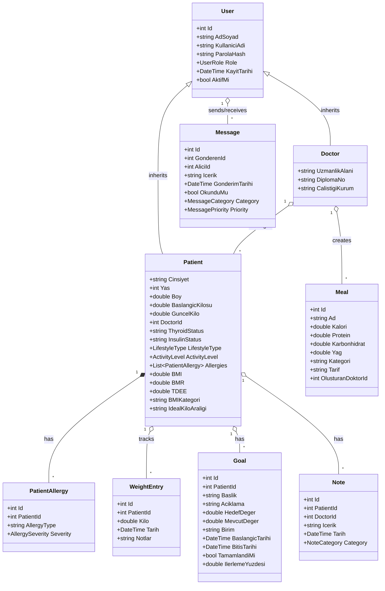
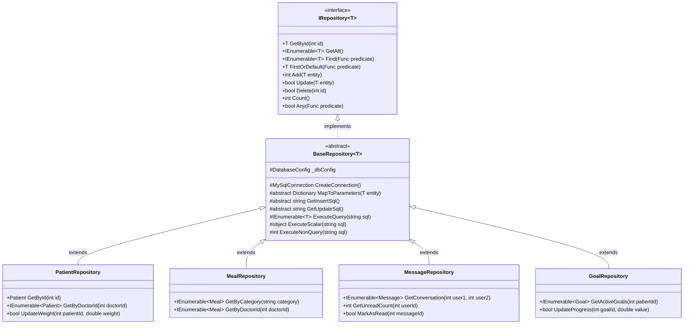
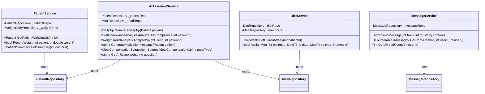
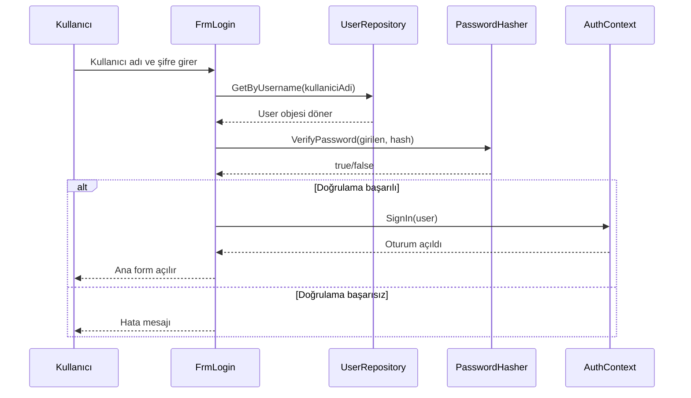
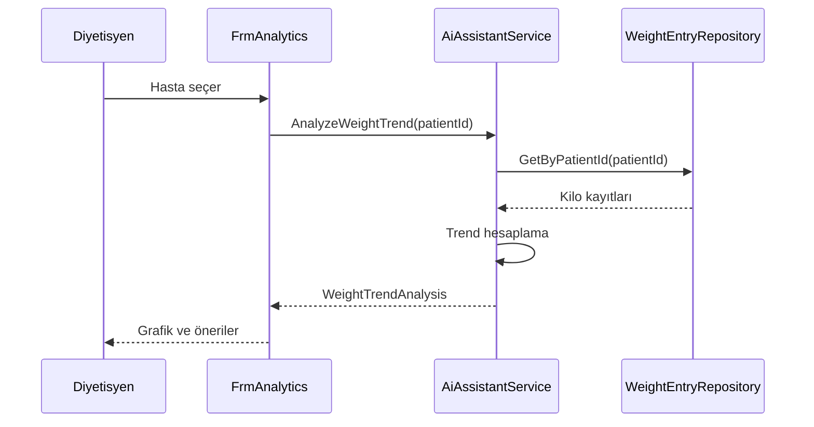
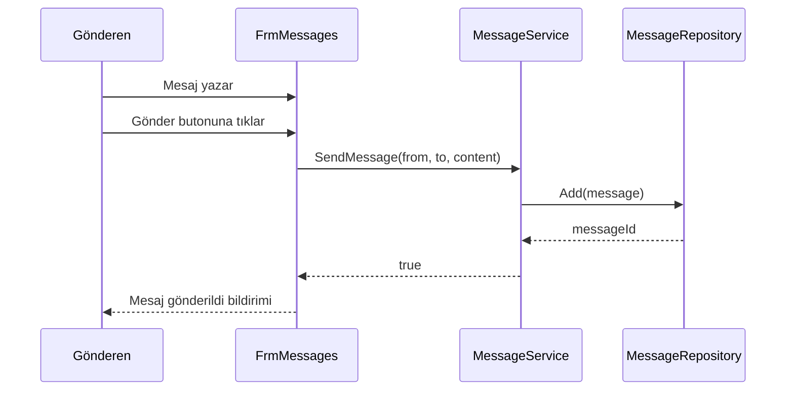

# Sınıf Diyagramları - Diyetisyen Otomasyon Sistemi

## Genel Mimari

Proje katmanlı mimari (Layered Architecture) kullanmaktadır:
- **Domain Layer**: İş mantığı ve entity'ler
- **Infrastructure Layer**: Veri erişimi ve servisler
- **Presentation Layer**: Windows Forms UI

---

## Domain Layer Sınıf Diyagramı



---

## Infrastructure Layer - Repository Pattern



---

## Service Layer



---

## Tasarım Desenleri

| Desen | Kullanım Yeri | Açıklama |
|-------|---------------|----------|
| **Repository Pattern** | Infrastructure/Repositories | Veri erişim katmanı soyutlama |
| **Template Method** | BaseRepository | Ortak CRUD operasyonları |
| **Inheritance** | User → Patient/Doctor | Domain modeli kalıtım |
| **Composition** | Patient ↔ PatientAllergy | Has-a ilişkisi |
| **Singleton** | AuthContext | Oturum yönetimi |
| **Strategy** | AiAssistantService | Farklı analiz algoritmaları |

---

## OOP Prensipleri Uygulaması

### Encapsulation (Kapsülleme)
```csharp
// Patient.cs - BMI hesaplama mantığı kapsüllenmiş
public double BMI
{
    get
    {
        if (Boy <= 0) return 0;
        return Math.Round(GuncelKilo / Math.Pow(Boy / 100, 2), 2);
    }
}
```

### Inheritance (Kalıtım)
```csharp
// Patient ve Doctor, User'dan miras alır
public class Patient : User { ... }
public class Doctor : User { ... }
```

### Polymorphism (Çok Biçimlilik)
```csharp
// IRepository<T> farklı tipler için farklı davranış
public interface IRepository<T> where T : class
{
    T GetById(int id);
    // ...
}
```

### Abstraction (Soyutlama)
```csharp
// BaseRepository abstract metotlar tanımlar
protected abstract string GetInsertSql();
protected abstract string GetUpdateSql();
```

---

## Sequence Diyagramları

### Hasta Giriş Akışı



### AI Analiz Akışı



### Mesaj Gönderme Akışı



