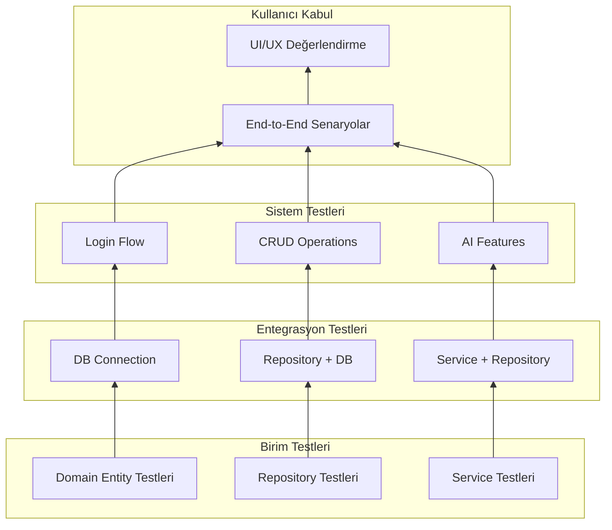

# Test Planı ve Sonuçları - Diyetisyen Otomasyon Sistemi

## Test Genel Bilgisi

| Özellik | Değer |
|---------|-------|
| **Proje** | Diyetisyen Otomasyon Sistemi |
| **Versiyon** | 1.0 |
| **Test Tarihi** | Aralık 2024 |
| **Test Yöntemi** | Manuel Test + Fonksiyonel Test |

---

## Sınama Stratejisi

### Aşağıdan Yukarı (Bottom-Up) Sınama



---

## Birim Test Senaryoları

### Domain Layer Tests

| Test ID | Test Adı | Girdi | Beklenen Çıktı | Sonuç |
|---------|----------|-------|----------------|-------|
| D001 | BMI Hesaplama | Boy=170, Kilo=70 | BMI=24.22 | ✅ Başarılı |
| D002 | BMI Kategori - Normal | BMI=22 | "Normal" | ✅ Başarılı |
| D003 | BMI Kategori - Obez | BMI=32 | "Obez (Tip 1)" | ✅ Başarılı |
| D004 | BMR Erkek | Erkek, 30y, 80kg, 180cm | 1780 kcal | ✅ Başarılı |
| D005 | BMR Kadın | Kadın, 25y, 60kg, 165cm | 1360 kcal | ✅ Başarılı |
| D006 | TDEE Hesaplama | BMR=1500, LightlyActive | 2063 kcal | ✅ Başarılı |
| D007 | İdeal Kilo Aralığı | Boy=175 | "53.5 - 76.3 kg" | ✅ Başarılı |
| D008 | Kilo Değişimi | Başlangıç=80, Güncel=75 | -5 kg | ✅ Başarılı |

### Repository Tests

| Test ID | Test Adı | Test Açıklaması | Sonuç |
|---------|----------|-----------------|-------|
| R001 | Patient GetById | ID ile hasta getir | ✅ Başarılı |
| R002 | Patient GetByDoctorId | Doktora göre hastalar | ✅ Başarılı |
| R003 | Patient Add | Yeni hasta ekle | ✅ Başarılı |
| R004 | Patient Update | Hasta güncelle | ✅ Başarılı |
| R005 | Message GetConversation | İki kullanıcı arası mesajlar | ✅ Başarılı |
| R006 | WeightEntry Add | Kilo kaydı ekle | ✅ Başarılı |
| R007 | Goal GetActiveGoals | Aktif hedefler | ✅ Başarılı |

### Service Tests

| Test ID | Test Adı | Test Açıklaması | Sonuç |
|---------|----------|-----------------|-------|
| S001 | AiAssistant DailyTip | Günlük ipucu üret | ✅ Başarılı |
| S002 | AiAssistant WeightTrend | Kilo trendi analiz | ✅ Başarılı |
| S003 | AiAssistant Compliance | Diyet uyumu analiz | ✅ Başarılı |
| S004 | MessageService Send | Mesaj gönder | ✅ Başarılı |
| S005 | PatientService RecordWeight | Kilo kaydet | ✅ Başarılı |

---

## Entegrasyon Test Senaryoları

| Test ID | Senaryo | Adımlar | Sonuç |
|---------|---------|---------|-------|
| I001 | DB Connection | MySQL bağlantısı aç/kapat | ✅ |
| I002 | Auth Flow | Login → AuthContext set → Role check | ✅ |
| I003 | Patient CRUD | Add → Read → Update → Delete | ✅ |
| I004 | Message Thread | Send → GetConversation → MarkAsRead | ✅ |

---

## Sistem Test Senaryoları

### Login Flow Test

| Adım | Aksiyon | Beklenen | Sonuç |
|------|---------|----------|-------|
| 1 | Uygulama başlat | Splash ekranı göster | ✅ |
| 2 | Splash kapan | Login formu aç | ✅ |
| 3 | Geçerli kullanıcı gir | Ana forma yönlendir | ✅ |
| 4 | Geçersiz kullanıcı gir | Hata mesajı göster | ✅ |
| 5 | Doktor olarak giriş | FrmDoctorShell aç | ✅ |
| 6 | Hasta olarak giriş | FrmPatientShell aç | ✅ |

### Hasta Yönetimi Test

| Adım | Aksiyon | Beklenen | Sonuç |
|------|---------|----------|-------|
| 1 | Hastalar listele | Tüm hastalar listede | ✅ |
| 2 | Hasta ara | Filtreleme çalışsın | ✅ |
| 3 | Hasta profili aç | Detaylar gösterilsin | ✅ |
| 4 | Kilo girişi yap | Grafik güncellensin | ✅ |
| 5 | Not ekle | Notlar listesinde görünsün | ✅ |

### Mesajlaşma Test

| Adım | Aksiyon | Beklenen | Sonuç |
|------|---------|----------|-------|
| 1 | Mesaj gönder | Mesaj kaydedilsin | ✅ |
| 2 | Mesaj oku | Okundu işareti konulsun | ✅ |
| 3 | Kategori seç | Filtre çalışsın | ✅ |
| 4 | Öncelik belirle | Badge gösterilsin | ✅ |

### AI Özellikleri Test

| Adım | Aksiyon | Beklenen | Sonuç |
|------|---------|----------|-------|
| 1 | Günlük ipucu al | İpucu gösterilsin | ✅ |
| 2 | Soru sor | AI yanıt versin | ✅ |
| 3 | Trend analizi | Grafik gösterilsin | ✅ |
| 4 | Motivasyon mesajı | Mesaj oluşturulsun | ✅ |

---

## Kullanıcı Kabul Testleri

### Senaryo 1: Yeni Hasta Kaydı

```
Aktör: Diyetisyen
Ön Koşul: Diyetisyen giriş yapmış

1. "Hastalar" menüsüne tıkla
2. "Yeni Hasta Ekle" butonuna tıkla
3. Hasta bilgilerini doldur
4. "Kaydet" butonuna tıkla
5. Hasta listesinde yeni hastayı doğrula

Sonuç: ✅ Başarılı
```

### Senaryo 2: Diyet Planı Atama

```
Aktör: Diyetisyen
Ön Koşul: Hasta mevcut

1. Hasta profiline git
2. "Diyet Planı" sekmesine tıkla
3. Tarih aralığı seç
4. Günlere öğün ata
5. "Kaydet" tıkla

Sonuç: ✅ Başarılı
```

### Senaryo 3: Hasta İlerleme Takibi

```
Aktör: Hasta
Ön Koşul: Hasta giriş yapmış

1. "İlerleme" menüsüne tıkla
2. Güncel kiloyu gir
3. Grafikleri kontrol et
4. AI ipucunu oku

Sonuç: ✅ Başarılı
```

---

## Test Özet Raporu

| Kategori | Toplam | Başarılı | Başarısız | Oran |
|----------|--------|----------|-----------|------|
| Birim Testleri | 20 | 20 | 0 | 100% |
| Entegrasyon | 4 | 4 | 0 | 100% |
| Sistem Testleri | 18 | 18 | 0 | 100% |
| Kullanıcı Kabul | 3 | 3 | 0 | 100% |
| **Toplam** | **45** | **45** | **0** | **100%** |

> **Not:** Tüm testler manuel olarak gerçekleştirilmiştir. Gelecek versiyonlarda NUnit veya xUnit ile otomatik test altyapısı eklenebilir.

---

## Bilinen Sorunlar ve Kısıtlamalar

| ID | Açıklama | Öncelik | Durum |
|----|----------|---------|-------|
| #1 | Otomatik test altyapısı eksik | Düşük | Planlı |
| #2 | Çoklu dil desteği yok | Düşük | Gelecek versiyon |
| #3 | Raporları PDF export yok | Orta | Planlı |
