# Use Case Diyagramları - Diyetisyen Otomasyon Sistemi

## Genel Bakış

Bu dokümanda sistemin aktörleri ve kullanım senaryoları Mermaid formatında gösterilmektedir.

## Aktörler

| Aktör | Açıklama |
|-------|----------|
| **Diyetisyen (Doktor)** | Hasta yönetimi, diyet planları, mesajlaşma |
| **Hasta** | Profil görüntüleme, ilerleme takibi, mesajlaşma |
| **Sistem** | Otomatik AI analizleri, bildirimler |

---

## Ana Use Case Diyagramı

```mermaid
flowchart TB
    subgraph Actors["Aktörler"]
        D["🩺 Diyetisyen"]
        H["👤 Hasta"]
        S["⚙️ Sistem"]
    end
    
    subgraph UC_Auth["Kimlik Doğrulama"]
        UC1["Giriş Yap"]
        UC2["Kayıt Ol"]
        UC3["Çıkış Yap"]
    end
    
    subgraph UC_Patient["Hasta Yönetimi"]
        UC4["Hasta Listele"]
        UC5["Hasta Profili Görüntüle"]
        UC6["Hasta Ekle"]
        UC7["Hasta Güncelle"]
        UC8["Kilo Takibi Gir"]
    end
    
    subgraph UC_Diet["Diyet Yönetimi"]
        UC9["Diyet Planı Oluştur"]
        UC10["Öğün Tanımla"]
        UC11["Haftalık Menü Ata"]
        UC12["Yemek Veritabanı"]
    end
    
    subgraph UC_Goals["Hedef Yönetimi"]
        UC13["Hedef Belirle"]
        UC14["İlerleme Takibi"]
        UC15["Not Ekle"]
    end
    
    subgraph UC_Comm["İletişim"]
        UC16["Mesaj Gönder"]
        UC17["Mesaj Oku"]
        UC18["Bildirim Al"]
    end
    
    subgraph UC_AI["AI Analiz"]
        UC19["Kilo Trend Analizi"]
        UC20["Diyet Uyum Analizi"]
        UC21["Risk Uyarısı"]
        UC22["Motivasyon Mesajı"]
        UC23["Günlük İpucu"]
    end
    
    subgraph UC_Report["Raporlama"]
        UC24["Analitik Görüntüle"]
        UC25["Grafik Oluştur"]
    end

    D --> UC1
    D --> UC3
    D --> UC4
    D --> UC5
    D --> UC6
    D --> UC7
    D --> UC9
    D --> UC10
    D --> UC11
    D --> UC12
    D --> UC13
    D --> UC15
    D --> UC16
    D --> UC17
    D --> UC24
    D --> UC25
    
    H --> UC1
    H --> UC2
    H --> UC3
    H --> UC5
    H --> UC8
    H --> UC14
    H --> UC16
    H --> UC17
    H --> UC23
    
    S --> UC19
    S --> UC20
    S --> UC21
    S --> UC22
    S --> UC18
```

---

## Detaylı Use Case Açıklamaları

### UC1: Giriş Yap
| Özellik | Değer |
|---------|-------|
| **Aktör** | Diyetisyen, Hasta |
| **Ön Koşul** | Kullanıcı kayıtlı olmalı |
| **Ana Akış** | 1. Kullanıcı adı girer 2. Şifre girer 3. Sistem doğrular 4. Role göre yönlendirir |
| **Alternatif** | Hatalı giriş → Hata mesajı göster |

### UC9: Diyet Planı Oluştur
| Özellik | Değer |
|---------|-------|
| **Aktör** | Diyetisyen |
| **Ön Koşul** | Giriş yapılmış olmalı |
| **Ana Akış** | 1. Hasta seç 2. Tarih aralığı belirle 3. Öğünleri ata 4. Kaydet |
| **İş Kuralı** | Hasta alerjileri kontrol edilir |

### UC19: Kilo Trend Analizi (AI)
| Özellik | Değer |
|---------|-------|
| **Aktör** | Sistem |
| **Tetikleyici** | Yeni kilo kaydı girildiğinde |
| **Ana Akış** | 1. Son kayıtları analiz et 2. Trend belirle 3. Risk değerlendir 4. Öneri oluştur |
| **Çıktı** | WeightTrendAnalysis objesi |

---

## Actor-Use Case İlişki Matrisi

| Use Case | Diyetisyen | Hasta | Sistem |
|----------|:----------:|:-----:|:------:|
| Giriş Yap | ✅ | ✅ | - |
| Kayıt Ol | - | ✅ | - |
| Hasta Listele | ✅ | - | - |
| Hasta Profili | ✅ | ✅ | - |
| Diyet Planı Oluştur | ✅ | - | - |
| Kilo Takibi | ✅ | ✅ | - |
| Mesaj Gönder | ✅ | ✅ | - |
| AI Analiz | - | - | ✅ |
| Risk Uyarısı | - | - | ✅ |
